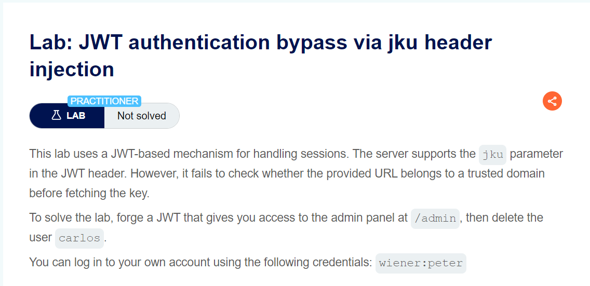
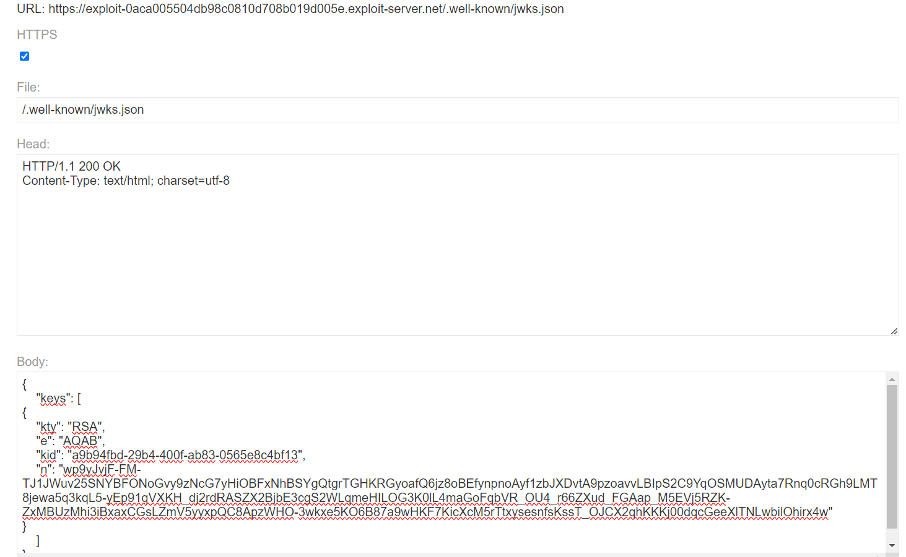
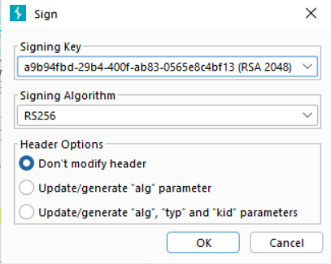

khởi động bằng mấy lab về JWT nào

ae nên tìm hiểu về JWT trước khi đọc wu này, vì cơ bản mình sẽ không giải thích nhiều nữa mà đi sâu vào exploit




Nói qua về jku cho bạn nào chưa biết thì đây là kiểu cung cấp key cho server qua url, nghĩa là server sẽ get key từ url này ( nếu được config trong header JWT )

mục tiêu của bài này là tại 1 con web lưu key của hacker rồi embedded nó vào header

lưu ý cho ae là sometime key jwt sẽ được lưu tại path 
```
/.well-known/jwks.json
đây được xem là 1 trong những endpoint chuẩn để setup key,
ví dụ nếu hacker setup key tại endpoint khác thì hên xui nhé, vì nó không phải chuẩn quy định
```

lab cung cấp cho ta 1 con server chứa key rồi, về việc create new key RSA mình sẽ không làm lại nữa, các bạn tìm hiểu về extension `JWT editor `trong Burpsuite




tại đây mình đã setup thành công key vào endpoint chuẩn, giờ chỉ việc nhúng em nó vô request 

thêm lưu ý nhỏ là khi sign đừng sửa header của JWT nhé


send request với phần data change `sub` to `administrator`

`Soong1002neverdie =)))`


