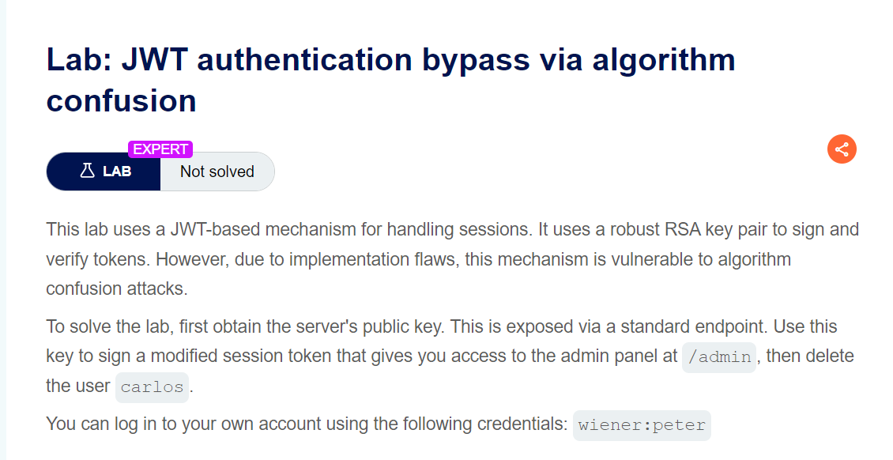
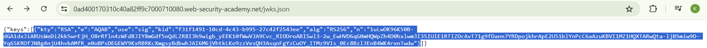
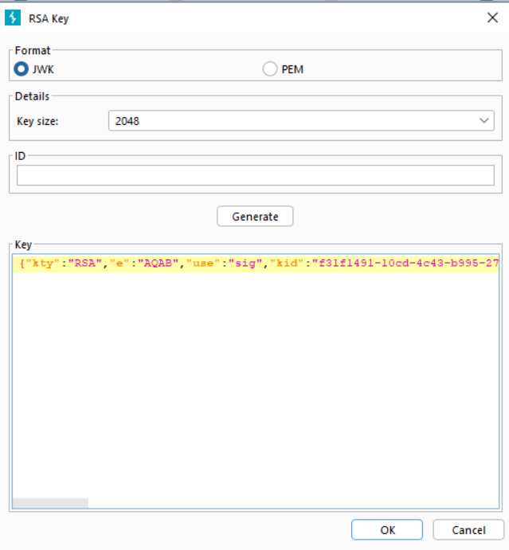
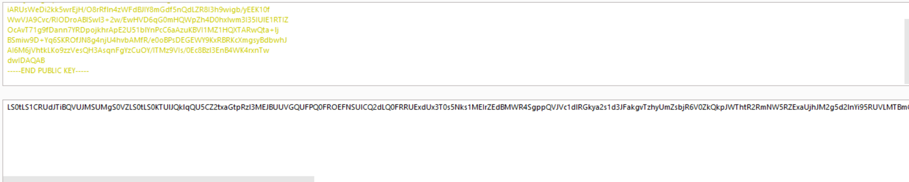
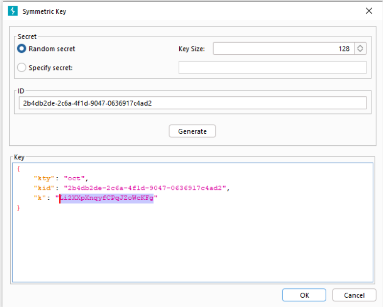

1 bài khá hay, đề cập tới cách kí và xác thực 

mình muốn giải thích qua 1 chút về việc kí và xác thực.
Có nhiều loại mật mã mà JWT có thể sử dụng, trong đó có symmetric và asymmetric, tạm dịch là mã đối xứng và bất đối xứng

`Nếu dùng mã đối xứng thì việc sign và authen sẽ sử dụng chung 1 key. Ngược lại với mã đối xứng thì mã bất đối xứng sử dụng khóa riêng(private) để sign và khóa chung( khóa công khai ) để authen`

nếu server xảy ra misconfig thì có thể gây ra sự confusion giữa việc sign and authen 

server sẽ sử dụng 1 số thư viện dựa vào phần header định nghĩa `alg` trong jwt để xác định sử dụng symmetric hay asymmetric. Nếu là HS256 thì nó sẽ dùng symmetric, còn nếu là RS256 hoặc ES256 sẽ sử dụng asymmetric

lợi dụng điều này, nếu hacker có thể lấy được public key thì việc sử dụng chính public key để authen hoàn toàn có thể xảy ra, chỉ cần sign jwt với header `alg = HS256`

Vấn đề xảy ra khi ta chưa biết được public key lưu trong server ở dạng nào, thông thường sẽ là PEM hoặc JWK. Điều này muốn bypass thì ta phải tìm ra được phía server lưu public key dạng nào trước

`Cơm thêm: PEM là 1 định dạng tiêu chuẩn để mã hóa và biểu diễn dữ liệu mật mã. PEM lưu dữ liệu dưới dạng bas64 `

OK đã phân tích xong đầy đủ kiến thức cần có, exploit thôi =)))

Đầu tiên vào endpoint `/jwks.json` để lấy public key

vì phía server sử dụng mã bất đối xứng để xác minh nên ta tiến hành tạo RSA key bằng `JWT editor`

paste public key vô để sign bằng public key và authen cũng bằng public key luôn

copy public key as PEM và decode nó 

tạo 1 symmetric key và thay `k = decode(PEM)` 

tiến hành sign với username=`administrator` và send request với endpoint `admin`

`soong1002maichat =))))`

