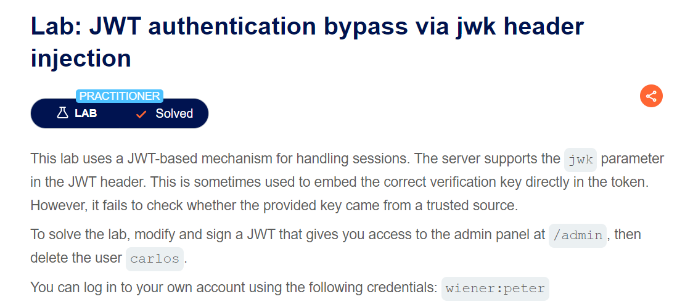
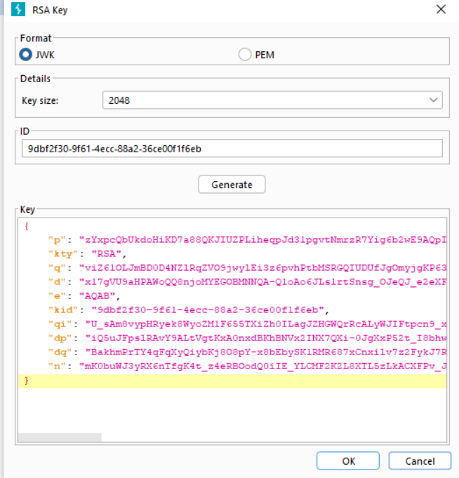

giải thích 1 chút về jwk: `jwk sẽ cung cấp 1 đối tượng JSON về biểu diễn khóa`

nghĩa là nó sẽ biểu diễn cho 1 key để sign data

extension nổi nhất về jwt trong burp là `jwt editor`

về cách sử dụng jwt editor mình se không nói lại
ta tiến hành embedded nó vào request với username=`administror`

click Attack with embedded jwt và select key vừa creater
thành công bypass authen

soong1002neverdie =)))