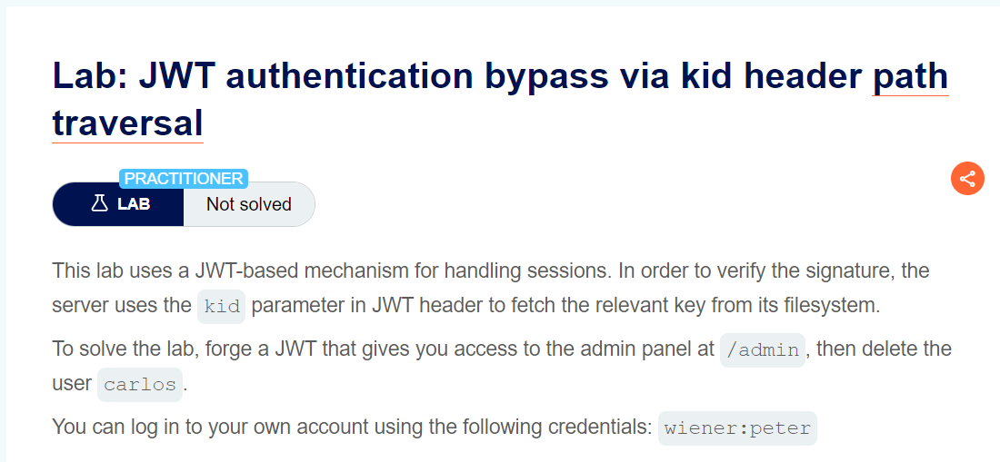
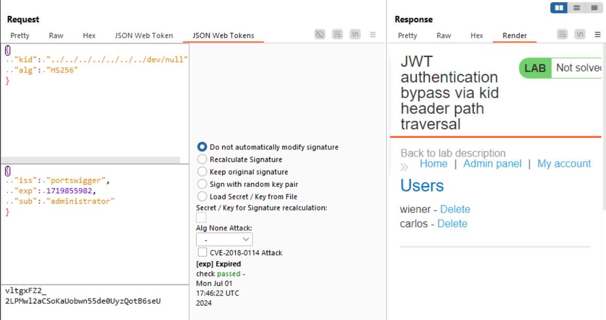

giải thích qua về kid: giúp server xác định key trong trường hợp có nhiều key lựa chọn 

bài này cần giải thích nhiều cho ae nào chưa biết
có những trường hợp server config sai dẫn tới việc để cho hacker có thể tự do truyền untrust data vào para `kid`, thông thường `kid` sẽ được setup sẵn trên server, nhưng vì có thể tự do truyền value cho nó mà hacker có thể thao túng value này
TUY NHIÊN cách bypass này chỉ hiệu quả khi server config cho phép sử dụng `symmetric key ( khóa đối xứng )` để dùng cho cả kí và xác thực

từ đó có thể hiểu, nếu bạn upload hay overwrite lên 1 file nào đó trên server rồi cho kid trỏ đến file đó thì nghĩa là bạn có thể thao túng được key để sign và authen

cách đơn giản nhất là cho `kid` trỏ đến 1 file luôn có trên server linux là file rỗng `/dev/null` . khi trỏ đến file này việc sử dụng key sign = null (rỗng) sẽ cho hacker bypass authen

tuy nhiên việc tạo khóa đối xứng trong JWT Editor không được phép `để trống` nên mình sẽ sử dụng dạng base64 của `null` là `AA==` để sửa value `k`.
sau đó sign và send request thôi

soong1002nerverdie =)))
