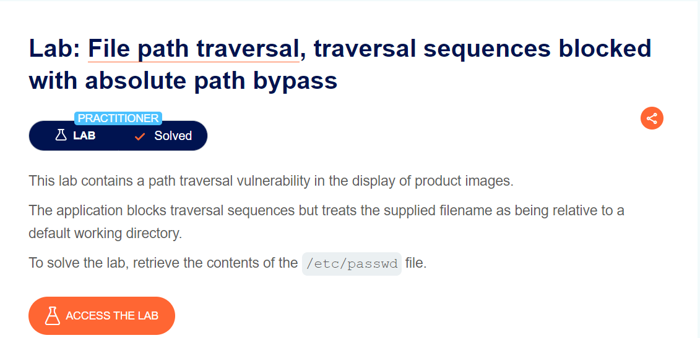
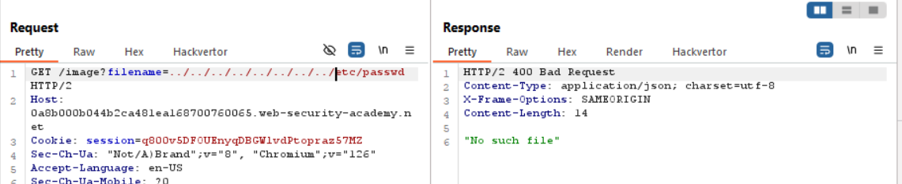
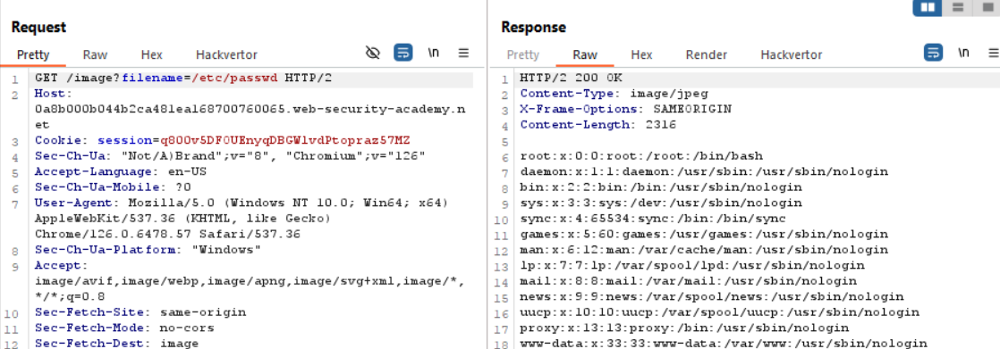

lỗi vẫn nằm ở việc đọc file image ra. chặn bắt burp suite rồi check thử nào

mình đã thử truyền rất nhiều `../` để cho file /etc/passwd ra tới document root nhưng vẫn báo lỗi `no such file`

nhưng =))))

bài này port ý muốn nhắc ae rằng có những web có thể dùng absolute path nhé, hoăc file /etc/passwd nằm ở thư mục gốc

`soong1002cuibap`