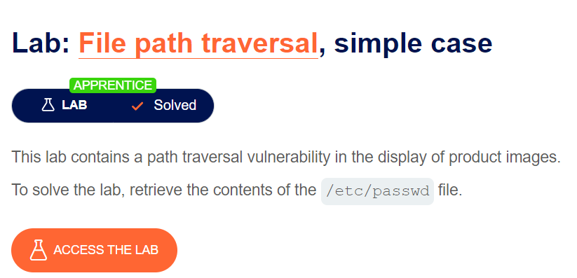
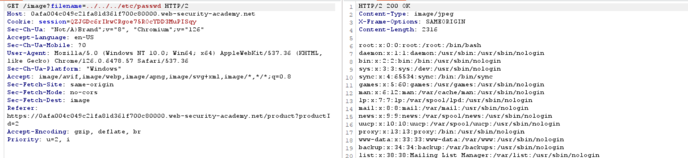

lý thuyết về path traversal mình sẽ không nhắc lại nhé ae, tập trung về phần exploit

portswigger luôn biết cách dụ dỗ =)), bài đầu tiên này rất cơ bản về lí thuyết path traversal

open image in new tab để lấy path của file ảnh

chặn bắt bằng burp suite nhé
truyền filename = `../../../etc/passwd`

`soong1002cuibap`

