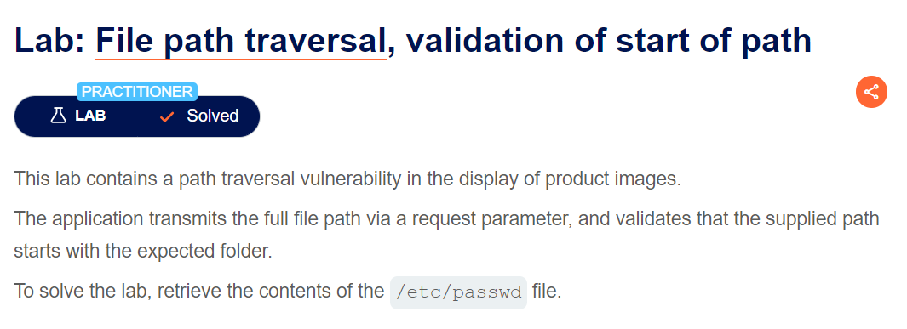
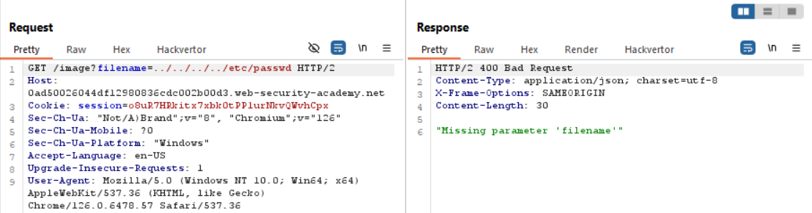
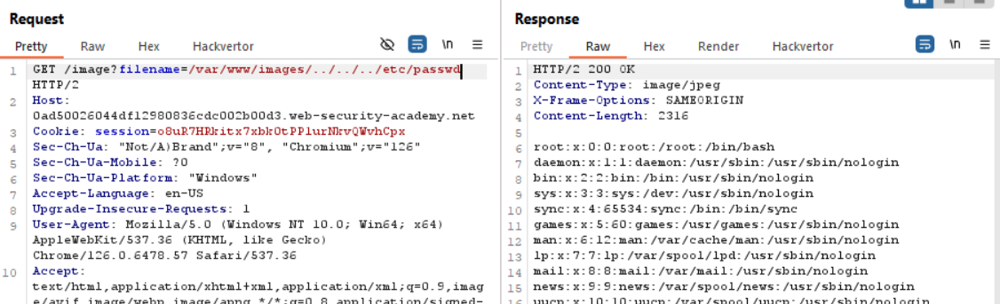

vẫn sẽ check hết các kiểu con đà điểu nhé =))

bài này đọc title mình nhận ra ngay nó sẽ yêu cầu có đường dẫn bắt đầu vào file, đại loại là mình exploit lỗi này ở giữa đường dẫn

nó báo lỗi láo chưa kìa, miss con mẹ gì =)))

