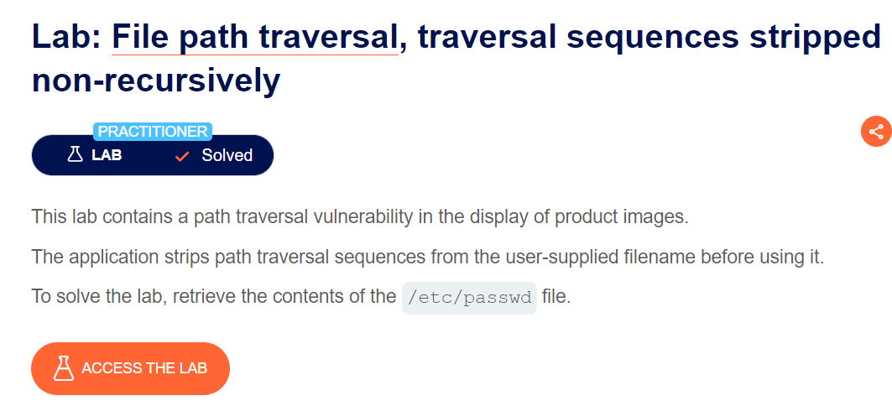
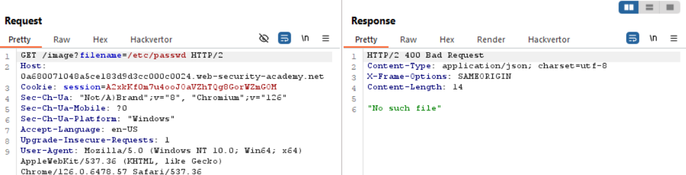
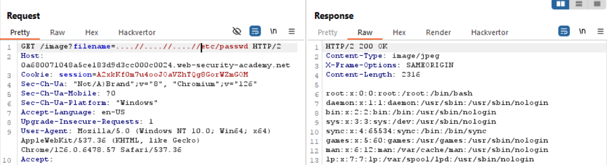

tiếp tục seri này nhé

mình đã thử truyền cả absolute và relative path nhưng đều không được

title nói rõ luôn solution rồi mà, ae có thể tư duy rằng server nó đã filter ../ rồi
nhưng sẽ ra sao nếu ta truyền vào là `....//....//....//`

thì phía BE nó sẽ cut 1 thằng `../` đi và còn lại 1 thằng `../` =)) vì nó không đệ quy mà

hear we go

`soong1002cuibap`

