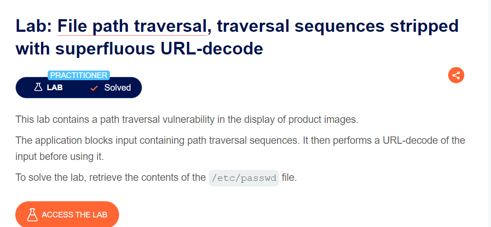
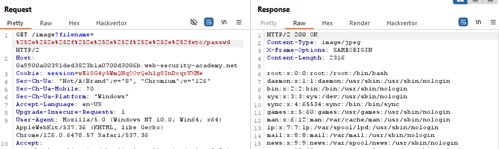

mấy bài này đơn giản nên mình viết nhanh thôi, ae có thể decode `../` để truyền vào url nhé. tất nhiên vẫn phải check hết các trường hợp trước khi decode nhé =))

mình tiến hành exploit luôn

`soong1002cuibap`
