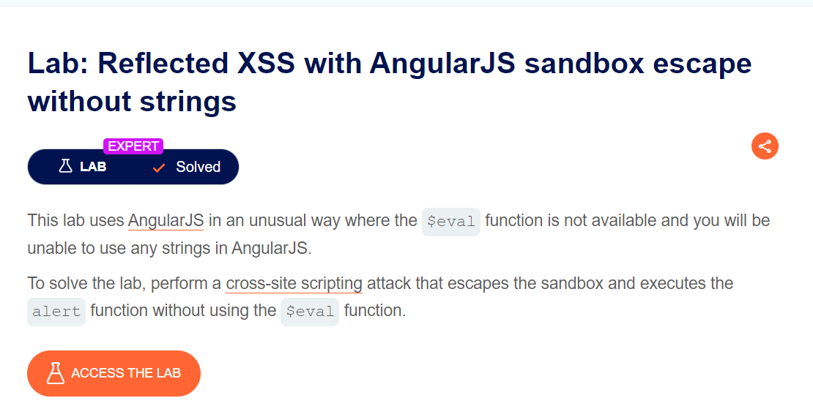
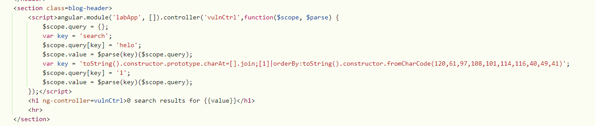

#### bài này mình ngồi tìm hiểu về charAt[].join và orderBy mất khá nhiều thời gian để hiểu được cốt lõi của 2 thằng này, dmmm =))))

Trong AngularJs có func `isIdent()` để check xem một biểu thức có phải là một dịnh danh hợp lệ hay không. định danh là một chuỗi kí tự được sử dụng để đặt teen cho các biến, hàm,...

Logic của hàm `isIdent()` nó so sánh những gì nó nghĩ là một kí tự đơn lẻ với nhiều kí tự, thằng này chính là nguyên nhân khiến mình phải dùng charAt[].join để làm cho nó hiểu nhầm chuỗi là 1 kí tự (cái này là tính chât của phương thức join)

Cái này khá khó hiểu, ae nên tự tìm hiểu thêm



```
https://0abb00ff049454a0801db29100190072.web-security-academy.net/?search=helo&toString().constructor.prototype.charAt%3d[].join;[1]|orderBy:toString().constructor.fromCharCode(120,61,97,108,101,114,116,40,49,41)=1
```

payload mình truyền vào

giải thích cho payload

Bằng cách gán [].join cho charAt , hành vi của phương thức charAt được thay đổi để nối tất cả các phần tử của một mảng thành một chuỗi, thay vì trích xuất các ký tự từ một chuỗi. Điều này sẽ giúp bypass sandbox của AngularJS

kết thúc thay đổi bằng dấu chấm phẩy, sau dấu chấm phẩy sẽ là payload chính gây ra XSS

Phần tiếp theo của payload là `1`. Điều này tạo ra một mảng có một phần tử, đó là số 1, `|` ở đây không phải OR mà là lấy mảng bên trái áp dụng với biểu thức bên phải thông qua OrderBy 

`toString().constructor.fromCharCode(120,61,97,108,101,114,116,40,49,41)=1` . Đây là một biểu thức JavaScript chuyển đổi mã ASCII: (120,61,97,108,101,114,116,40,49,41) thành chuỗi x=alert(). Đây là một mã JavaScript độc hại hiển thị thông báo cảnh báo có giá trị 1 . Nói cách dễ hiểu hơn thì phần expression của orderBy nó là x=alert(1), phần expression này gây ra lỗi XSS khi Angular đánh giá và execute nó

Phần `=1` cuối của biểu thức được bao gồm để đảm bảo rằng biểu thức trả về giá trị đúng. Trong AngularJS, filter mong đợi giá trị đúng được trả về từ biểu thức đối số, biểu thức trả về giá trị đúng 1 , cho phép filter orderBy thực thi mã JavaScript độc hại.

Done!!

`soong1002cuibap`
