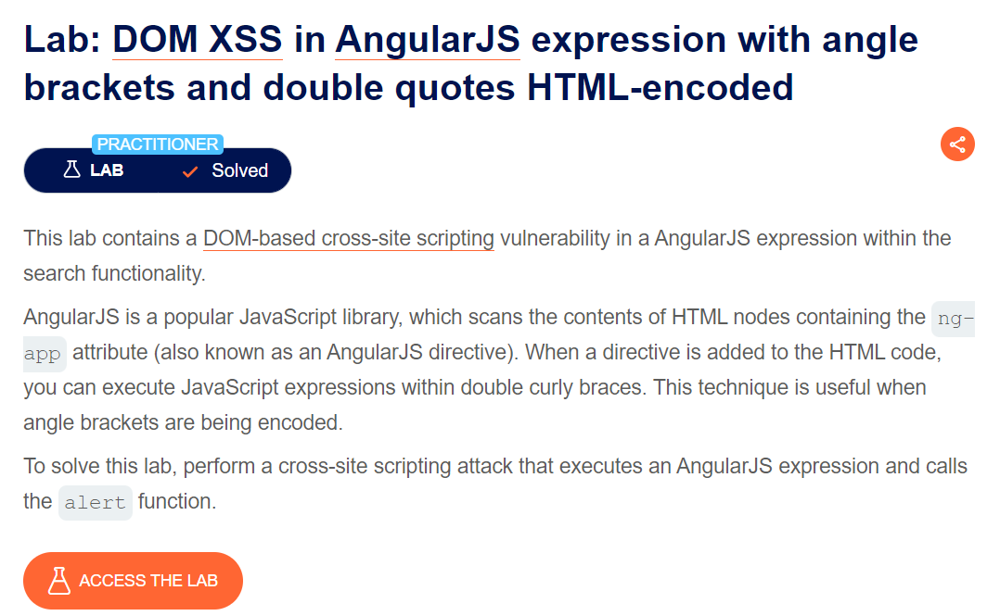
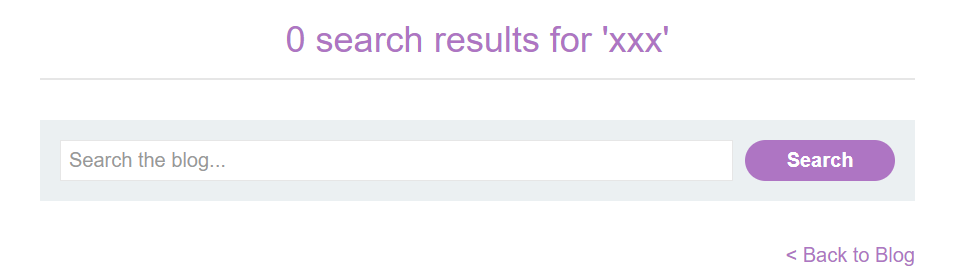
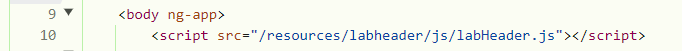
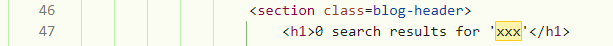
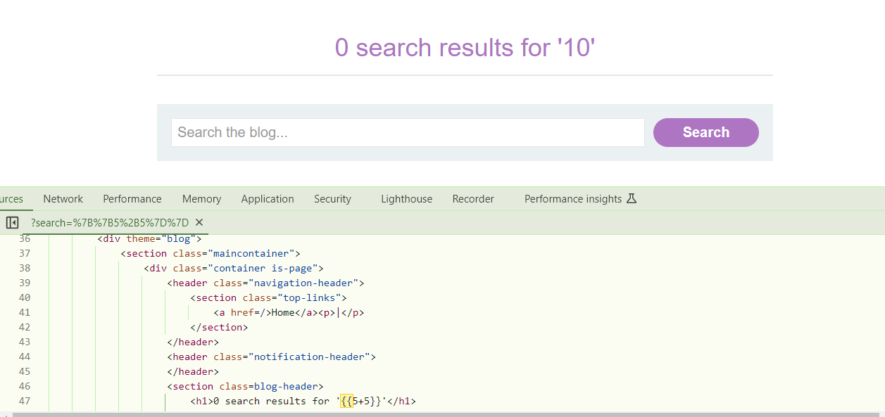
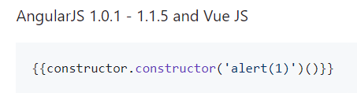

### des: bài này liên quan đến AngularJS expression tại feature search, còn angularJS là gì ae tìm hiểu nhé, mình sẽ không giải thích lại

khi mình nhập vào search value xxx thì nó được reflected vào h1 mà dòng 9 chứa ng-app

mình sẽ thử 1 expession

ae có thể thấy khi mình truyền `{{5+5}}` thì angularJS nó làm hộ mình phép tính luôn được kết quả =))

gg payload xss cho angularJS nào

ở đây do version dev sử dụng là 1.1 nên mình dùng cái này nhé

`soong1002chatvl`

