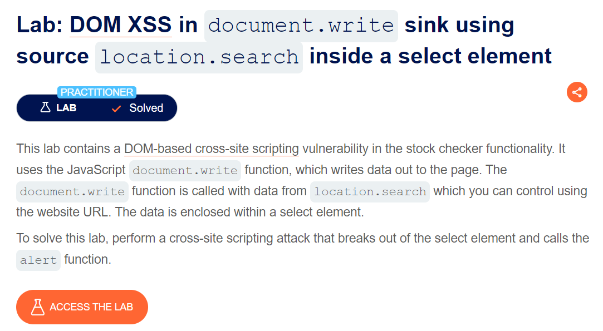
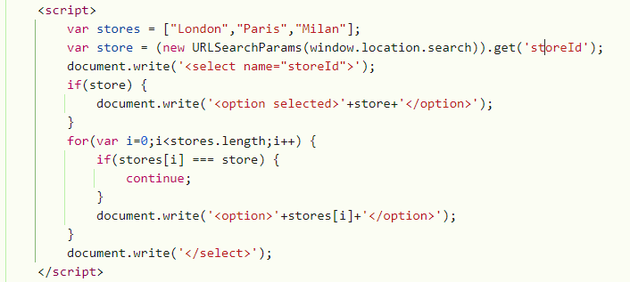
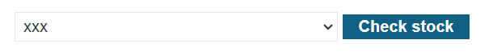

des: lab chứa lỗi xss tại feature stock checker

document.write cho phép người dùng viết data lên page thông qua location.search

### cho ae nào chưa biết thì location.search sẽ trả về phần url từ dấu ? trở đi (phần parameter)

### oke, vậy nghĩa là ta có thể kiểm soát untrusted data từ hàm location.search rồi cho gọi document.write để xss 

quan sát source mình thấy hàm document.write lấy value từ class name = 'storeId', mà class này lại có thể kiểm soát được thông qua `window.location.search` 

mình tiến hành thêm para storeId trên url như sau:
`https://0a9000a704439a7083001a9600470020.web-security-academy.net/product?productId=2&storeId=xxx`

quan sát thấy mình đã tác động lên DOM được rồi, tiến hành truyền payload xss thôi

`https://0a9000a704439a7083001a9600470020.web-security-academy.net/product?productId=2&storeId="></select>`

giải thích cho payload này nằm ở dòng `document.write('<select name="storeId">');`
