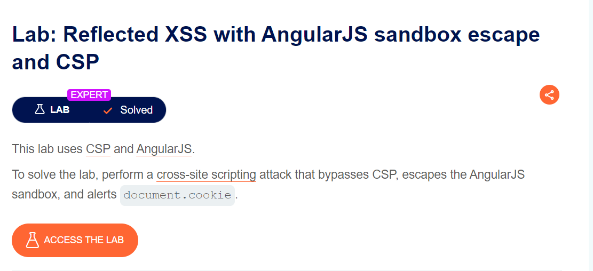
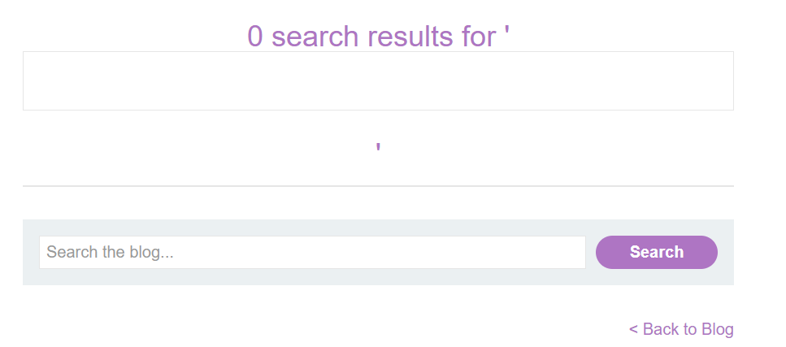

#### về angularJS mình không giải thích lại, mình sẽ nói qua về CSP
#### CSP (content security policy) là chính sách bảo mật từ phía trình duyệt nhằm giảm thiểu khả năng tấn công khai thác dữ liệu, trong đó có XSS. CSP cho phép admin kiểm soát tài nguyên nào có thể tải lên và execute bởi trang web

khi kết hợp angularJS với CSP giúp tăng khả năng bảo mật, quản lí các tài nguyên có thể exec, nhưng cần phải được kết hợp chặt chẽ

bài lab này chứa lỗ hổng do cấu hình chưa chặt chẽ về việc kết hợp angularJS với CSP, dẫn tới func search của web dính lỗi XSS



ở đây mình thử truyền `<input id=x>`
kết quả nó sẽ tạo ra được 1 form input, từ đó mình suy đoán nó có thể dính reflected xss 

như đã phân tích bên trên, CSP sẽ block các sự kiện javascript, tuy nhiên AngularJS lại định nghĩa các sự kiện riêng của nó có thể dùng để thay thế, trong đó nổi tiếng là `$event` tham chiếu tới obj sự kiện của trình duyệt.

điều đáng nói là trong chorme chứa 1 thuộc tính đặc biệt là `path`, nó là 1 mảng chứa các sự kiện đã đi qua

trong các phiên bản mới hơn, việc dùng `$event.composedPath()` sẽ tương thích hơn so với việc dùng `$event.path`

đó là hướng mình sẽ bypass CSP, còn về angularJS vẫn nổi tiếng quen thuộc nếu không có `$eval` mình sẽ sử dụng `orderBy` với `expression`

(angularJs sẽ đánh giá và thực thi expression)

được rồi, và đây là payload của mình

`<input id=x ng-focus=$event.composedPath()|orderBy:'(a=alert)(document.cookie)'>#x`

chỗ này nếu sau orderBy ta dùng luôn 'alert(document.cookie)' nó sẽ làm cho angularJS không đánh giá biểu thức, nên mình đã thêm biểu thức '=' vào cho nó đánh giá và execute alert

payload gửi victim đầy đủ
```
<script>
location='https://0af10021035539bf801449d70010001c.web-security-academy.net/?search=%3Cinput%20id=x%20ng-focus=$event.composedPath()|orderBy:%27(a=alert)(document.cookie)%27%3E#x';
</script>
```

`soong1002gaqua`


