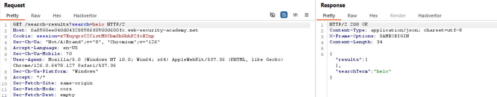

#### des: như trong mô tả, quá rõ rồi =)))

view source chú ý tới hàm `eval` và biến `searchResultsObj`

ae nên gg tìm hiểu xem hàm eval nó làm gì nhé
dòng 21,22 các biến được gán bởi searchResultsObj.searchTerm và results, đây là 2 thuộc tính của searchResultsObj. Vấn đề xảy ra là 2 giá trị searchTerm và results ta có thể control được qua feature Search của Trang Web

giờ mình sẽ đổi para để thay đổi value searchTerm nhé,

`soong1002`